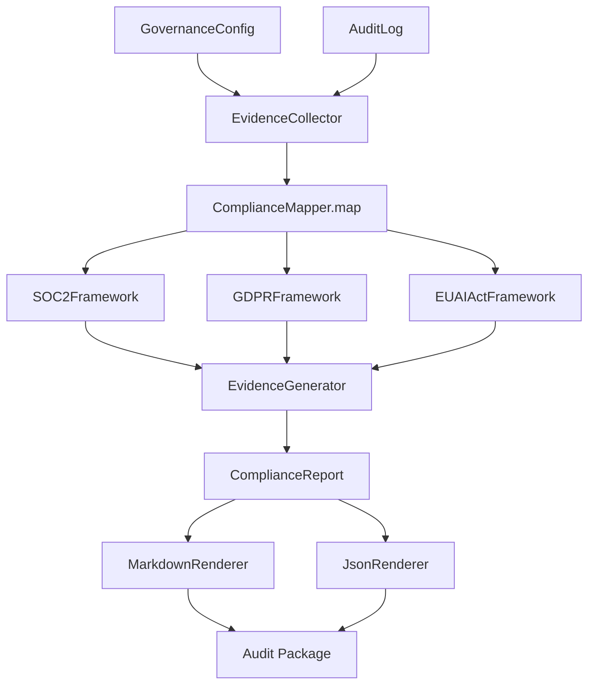

# @aumos/compliance-mapper

[](https://github.com/aumos-ai/compliance-mapper)

Auto-generate SOC 2 Type II, GDPR, and EU AI Act compliance evidence from governance configs and audit logs.

Part of the [Aumos OSS](https://github.com/muveraai/aumos-oss) governance toolkit — Phase 4, Project 4.1.

---

## Why Does This Exist?

Every regulated enterprise running AI agents faces the same painful question at audit time: "Show me your evidence." Evidence that your agents are governed properly. Evidence that data is handled lawfully. Evidence that your AI systems meet the requirements of EU AI Act, SOC 2, or ISO 42001.

The problem is that the data to answer these questions already exists — in your governance configuration files and your audit logs. The gap is the mapping: turning machine-readable governance data into the specific format that auditors and regulators expect.

Think of it like a tax accountant. Your financial records contain all the information the tax authority needs. But the authority does not want your raw records — it wants them structured into specific forms with specific line items. A skilled accountant does not create new information; they translate what you already have into the format that satisfies the requirement.

**Without compliance-mapper**, engineering teams spend weeks before each audit manually correlating config values to control requirements, writing narrative evidence by hand, and hoping nothing was missed. Compliance becomes a periodic fire drill instead of a continuous, automatable process.

compliance-mapper automates the translation layer. It reads your governance configs and structured audit logs, applies per-framework mappings to extract evidence items, identifies gaps where controls are not yet satisfied, and produces point-in-time compliance evidence packages in Markdown and JSON.

> The missing layer between your governance data and your audit package — turning what you already have into what regulators need.

---

## Who Is This For?

| Audience | Use Case |
|---|---|
| **Developer** | Embed compliance evidence generation into CI/CD pipelines and governance tooling |
| **Enterprise** | Produce audit-ready documentation without manual effort before each regulatory review |
| **Both** | Continuously track compliance posture and close gaps before they become findings |

---

## Quick Start (TypeScript)

### Prerequisites

- Node.js 18+
- Your governance config object and structured audit log

### Install

```bash
npm install @aumos/compliance-mapper
```

### Minimal Working Example

```typescript
import {
  ComplianceMapper,
  SOC2Framework,
  GDPRFramework,
} from "@aumos/compliance-mapper";

const mapper = new ComplianceMapper();
const report = await mapper.map(
  governanceConfig,
  auditLog,
  [new SOC2Framework(), new GDPRFramework()]
);

console.log(report.summary);
// Compliance check: 2026-02-27T00:00:00Z
// SOC2: 47/50 controls satisfied (3 gaps)
// GDPR: 14/16 articles satisfied (2 gaps)

console.log(report.gaps);
// [{ framework: "SOC2", control: "CC6.1", reason: "No MFA evidence in audit log" }, ...]
```

### What Just Happened?

`ComplianceMapper.map()` ran your governance config and audit log through each framework's control mapping. For every control, it looked for evidence in the data you provided — a specific config key, a log entry matching a pattern, a policy field. It returned a point-in-time snapshot: which controls are satisfied, which are not, and why. No state is stored; every call is a fresh analysis.

---

## Quick Start (Python)

### Prerequisites

- Python 3.10+

### Install

```bash
pip install compliance-mapper
```

### Minimal Working Example

```python
from compliance_mapper import ComplianceMapper
from compliance_mapper.frameworks import SOC2Framework, GDPRFramework

mapper = ComplianceMapper()
report = mapper.map(
    governance_config=governance_config,
    audit_log=audit_log,
    frameworks=[SOC2Framework(), GDPRFramework()],
)

print(report.summary)
# Compliance check: 2026-02-27T00:00:00Z
# SOC2: 47/50 controls satisfied (3 gaps)
# GDPR: 14/16 articles satisfied (2 gaps)
```

---

## Architecture Overview



compliance-mapper sits between your live governance system and your audit documentation workflow. It consumes static snapshots — no continuous connection to your governance runtime is required.

---

## Supported Frameworks

| Framework | Coverage |
|---|---|
| **SOC 2 Type II** | 50+ Trust Services Criteria controls |
| **GDPR** | Articles 5–22, 25, 32, 35 |
| **EU AI Act** | Chapter 2 high-risk AI system requirements |

The `ComplianceFramework` interface (TypeScript) and `ComplianceFrameworkABC` (Python) let you add your own regulatory mappings without touching the core engine. See [docs/adding-frameworks.md](./docs/adding-frameworks.md).

---

## Packages

| Package | Language | Registry |
|---|---|---|
| `@aumos/compliance-mapper` | TypeScript | npm |
| `compliance-mapper` | Python | PyPI |

---

## Related Projects

| Project | Relationship |
|---|---|
| [aumos-core](https://github.com/aumos-ai/aumos-core) | Provides the `GovernanceConfig` and `AuditLog` schemas that compliance-mapper consumes |
| [anomaly-sentinel](https://github.com/aumos-ai/anomaly-sentinel) | Detects suspicious patterns in audit trails — feeds into the same audit logs compliance-mapper reads |
| [mcp-server-trust-gate](https://github.com/aumos-ai/mcp-server-trust-gate) | The enforcement layer that produces the audit records compliance-mapper maps to controls |
| [context-firewall](https://github.com/aumos-ai/context-firewall) | Domain isolation — evidence of its configuration satisfies GDPR data minimization controls |

---

## Fire Line

See [FIRE_LINE.md](./FIRE_LINE.md) for explicit scope boundaries.

---

## License

Business Source License 1.1 — see [LICENSE](./LICENSE).
